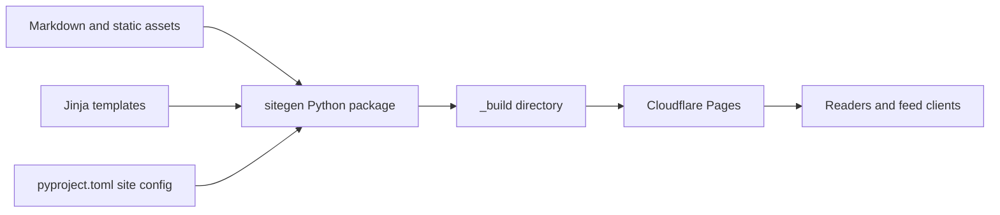
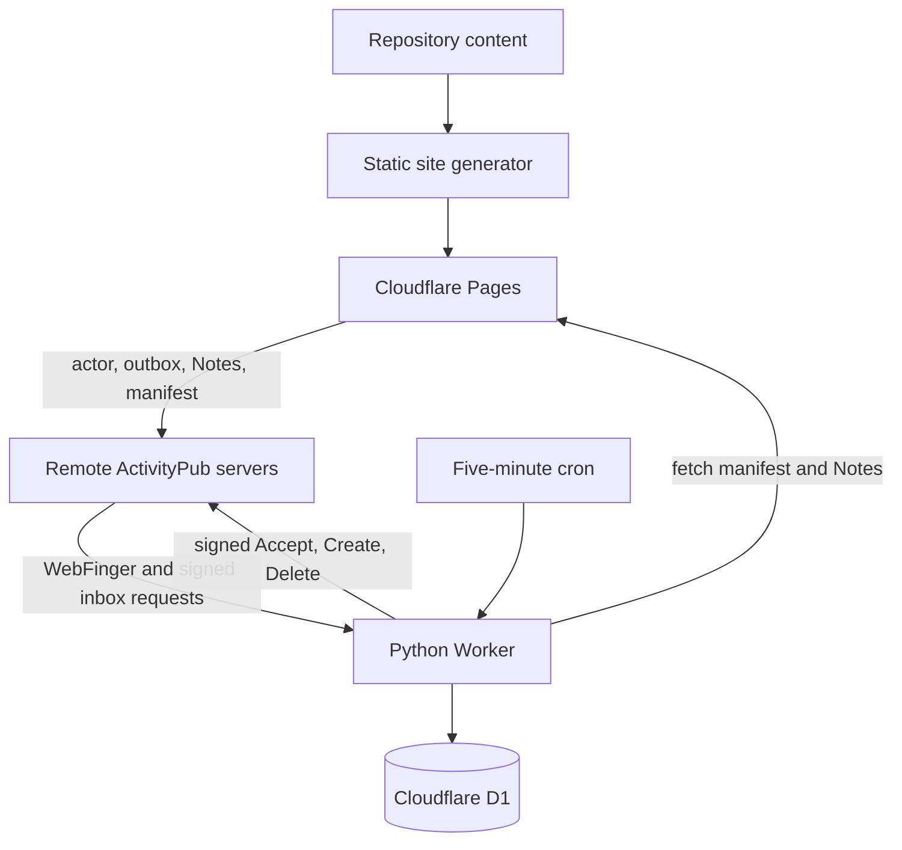
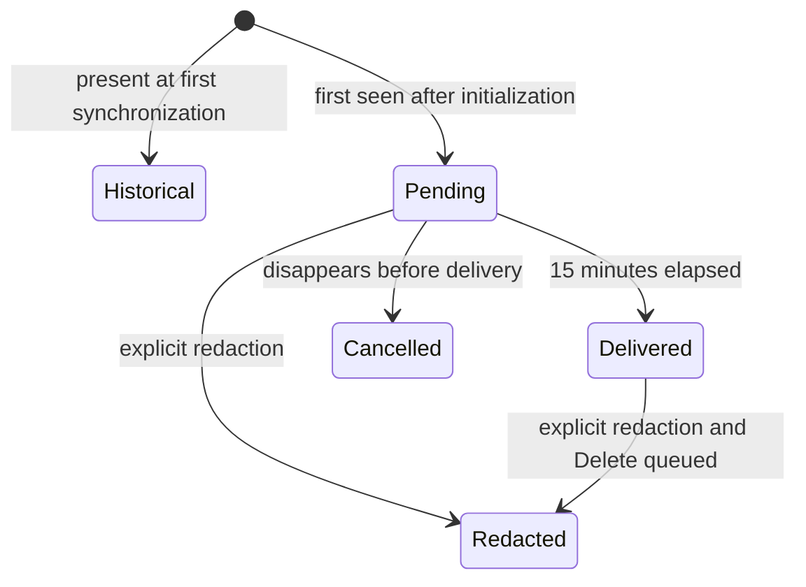

# Architecture

wrla.ch is primarily a statically generated blog. ActivityPub adds a small
stateful service without moving the site itself into an application server.
Two Cloudflare deployments therefore share the `wrla.ch` hostname:

- the existing Pages project serves the generated site and immutable
  ActivityPub documents;
- the `wrla-ch-activitypub` Python Worker handles requests that require
  validation, persistence, or outbound federation.

## Main site

Posts live in timestamped directories under `src/posts/`; ordinary pages live
under `src/pages/`. `uv run site build` loads their Markdown and front matter,
validates headings, renders Markdown, and passes the result through Jinja
templates. Static CSS, JavaScript, images, fonts, and files are copied alongside
the rendered output.

The build is deliberately disposable: `_build` is recreated from source each
time. It contains blog posts, index and tag pages, Atom and RSS feeds, a
sitemap, static assets, and the static ActivityPub documents described below.
Cloudflare Pages publishes `_build`; it does not execute the Python generator
for each request.

## ActivityPub components

The ActivityPub implementation is split according to whether data is durable
content or mutable federation state.

The site generator creates one `Service` actor, a paginated outbox, a stable
`Note` for each post, and `activitypub/manifest.json`. A Note contains the post
title, a short first-paragraph excerpt, canonical link, tags, and the first
image with useful alt text. The repository's public key is embedded in the
actor. Explicitly redacted posts become static `Tombstone` objects.

The Worker owns the private key as the `ACTIVITYPUB_PRIVATE_KEY` secret. D1
stores followers, observed post state, replies, likes and shares, queued
deliveries, retries, and the destinations that successfully received each
post. Pydantic models validate remote JSON, manifest data, Notes, and
multi-column database results at their boundaries.

All global fetches use Cloudflare's strictly-public routing. Remote URLs must
use HTTPS and cannot name localhost or a literal non-public IP address. Actor
and object fetches have a ten-second deadline, follow at most four redirects,
and stream at most 512 KiB into memory.

## URL routing

Cloudflare Worker routes intercept only the dynamic paths listed in
`activitypub/wrangler.toml`. All other requests continue to the Pages project.
The trailing `*` on WebFinger is intentional: Cloudflare route matching
includes the query string, and WebFinger uses `?resource=...`.

| URL | Served by | Behaviour |
| --- | --- | --- |
| `/`, `/log/*`, `/tags/*`, `/feeds/*` | Pages | Blog, archive, and conventional feeds |
| `/activitypub/wrlach` | Pages | Static actor and public key |
| `/activitypub/wrlach/outbox*` | Pages | Static paginated archive of `Create` activities |
| `/activitypub/posts/*` | Pages | Static `Note` or `Tombstone` objects |
| `/activitypub/manifest.json` | Pages | Worker-facing description of deployed posts |
| `/.well-known/webfinger?resource=...` | Worker | Resolves `acct:wrlach@wrla.ch` to the actor |
| `/activitypub/wrlach/inbox` | Worker | Accepts supported signed activities |
| `/activitypub/wrlach/followers` | Worker | Returns the active follower count |
| `/activitypub/replies/*` | Worker | Returns known verified reply URLs, paginated |
| `/activitypub/likes/*`, `/activitypub/shares/*` | Worker | Returns aggregate interaction counts |

Static ActivityPub responses receive the
`application/activity+json` content type through the generated Pages
`_headers` file. Dynamic responses set their content type in the Worker.

## Inbound federation

A remote server discovers the actor through WebFinger, fetches the static actor
document, and POSTs to its Worker-backed inbox. The Worker limits the request
size, validates its ActivityPub model, timestamp, digest, HTTP signature, actor,
and signing-key ownership before changing D1. A binding also limits the inbox
to 120 requests per minute in each Cloudflare location before these more
expensive operations run.

Supported activities are `Follow`, `Like`, `Announce`, public replies expressed
as `Create(Note)`, and corresponding `Undo` operations. A Follow records the
remote inbox or shared inbox and queues a signed `Accept`. Likes and shares are
idempotent per actor and post. Replies are retained as verified object URLs;
their remote HTML is neither trusted nor rendered on the blog. Unsupported,
misaddressed, unsigned, or unknown-post activities are rejected.

## Publication and delivery

Every five minutes the Worker fetches the manifest from the deployed Pages
site, even when outbound delivery is administratively disabled. Existing posts
on the first synchronization become `historical`, so
enabling federation does not flood followers with the archive. A later post is
`pending` for 15 minutes. When eligible, the Worker fetches the currently
deployed Note, groups active followers by shared inbox, queues stable `Create`
activities, and marks the post delivered. Polling production means a failed
Pages build cannot announce an unreachable post.

`OUTBOUND_DELIVERY_ENABLED` is the operational kill switch. When false, inbound
activities and manifest synchronization continue, but queued `Accept`,
`Create`, and `Delete` activities are not sent. Re-enabling it allows the next
cron invocation to process work that became due while delivery was paused.

Delivery is asynchronous and idempotent. Each cron invocation processes at
most 50 due records. Successful 2xx responses are recorded; transient network,
408, 425, 429, and 5xx failures use capped exponential backoff. A destination
is abandoned after eight attempts, while failure details remain in D1 for
inspection.

Redaction is explicit: removing Markdown alone never federates a deletion. A
matching entry in `activitypub/redactions.json` generates a Tombstone. If the
post was delivered, the Worker queues a signed `Delete` for every destination
that previously received it, including servers that are no longer active
followers. This is best-effort federation and cannot retract copies retained
by remote systems.

## Deployment boundary

The root `wrangler.toml` describes the Pages output. The Worker has its own
`activitypub/wrangler.toml`, D1 database, migrations, secret, cron, and Git
build configuration. Worker commands must run from `activitypub/` so Wrangler
selects the correct configuration. Deploying one component does not deploy the
other; production is complete only when both the generated Pages content and
the compatible Worker version are live.
