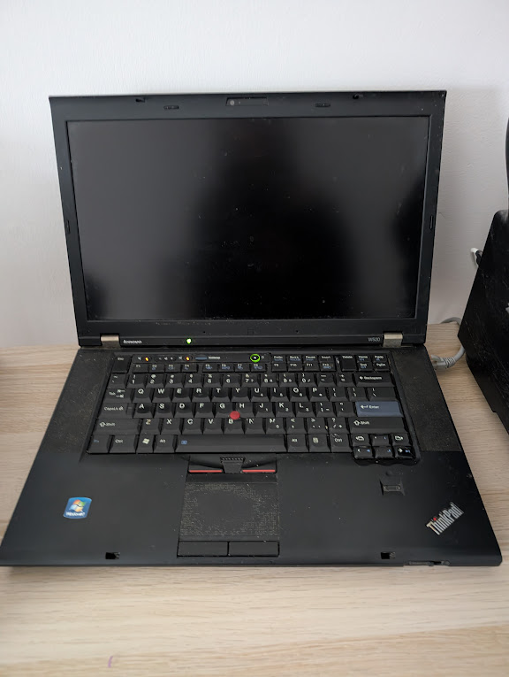
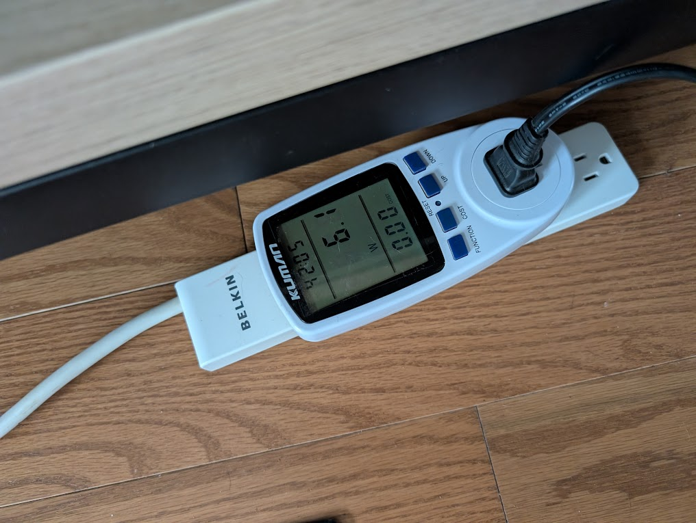
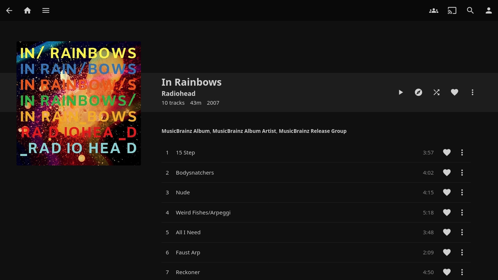
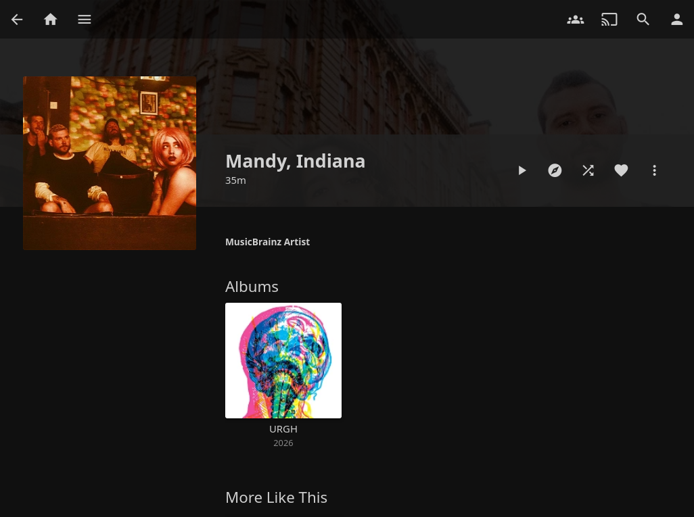

# Music updates

Made a few minor adjustments to my setup after getting off the streaming services ([archived post](https://archive.wrla.ch/blog/2026/01/rethinking-music-listening/)).

First, I reindexed/retagged some of my older music with [beets](https://beets.readthedocs.io/) (a lovely little Python package). Over the years I'd used a number of different (mostly Linux-based) tools to rip CDs, which had various levels of maturity. Pretty sure I ripped a Cocteau Twins CD (Four-Calendar Café) in around 2001 using one of the earliest versions of Ogg Vorbis. There were various levels of quality here, but Beets did a great job of renormalizing tag metadata and writing things into coherent files.

Second, I found using Syncthing rather annoying (it's great software, perpetually resyncing was annoying) so decided to bite the bullet and set up a media server with an old Thinkpad w520 that dates back to my Mozilla days (got it when I first started there in 2011 and then bought it back when it basically was worthless in 2014 or so). I used [Jellyfin](https://jellyfin.org/) media software, which is quite nice (I've heard [navidrome](https://www.navidrome.org/) is also good).

The Thinkpad uses surprisingly little power with the screen off, no wifi (I have an ethernet hard link), and the battery pulled out: about 6 watts. Over the course of the year that only adds up to about 50 kWh (`0.06kW * 24 hours * 365 days`), a drop in the bucket of our [annual electricity consumption](https://wlach.github.io/gtha-electrification/energy/).

I set up a small Tailscale network so I can access the server from outside the house: worked great. The server is probably living on borrowed time, but I can just swap out the disk into a new machine when it finally kicks the bucket.

Listening to a snapshot of my music collection from the mid 2000s is a bit of a time capsule, but it's been pleasant so far? There's a lot of stuff in my old collection that I haven't listened to in a while, and it's been fun to rediscover. I expect I'll be gradually putting newer stuff from Bandcamp into the rotation after that gets old. Already started to do that a bit: [Mandy Indiana](https://mandyindiana.bandcamp.com/) is great.

