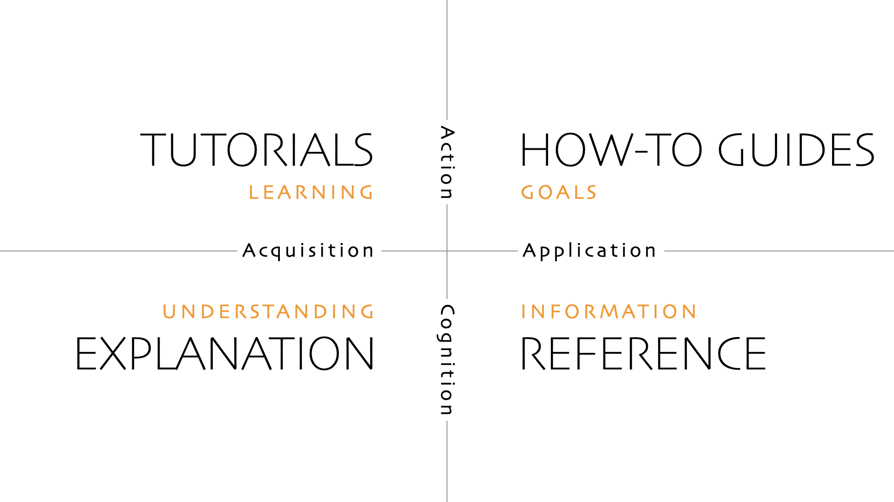
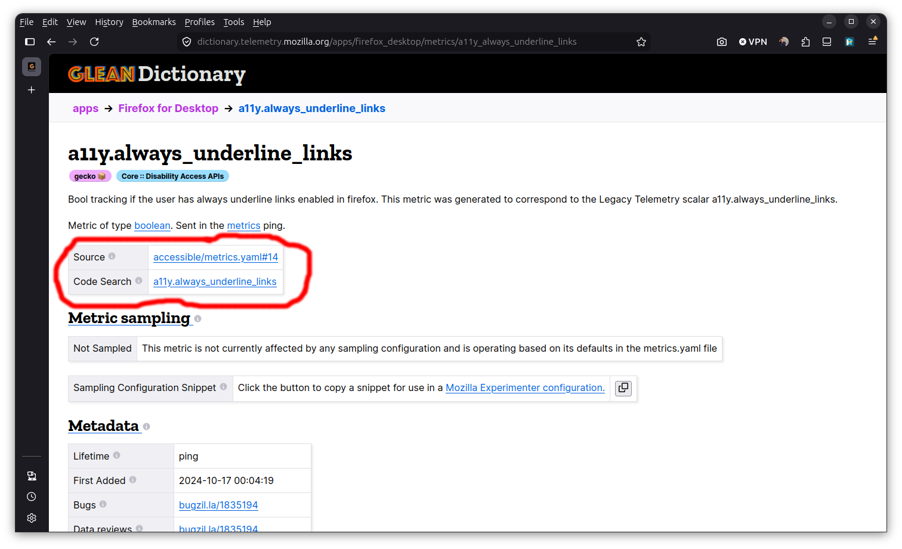
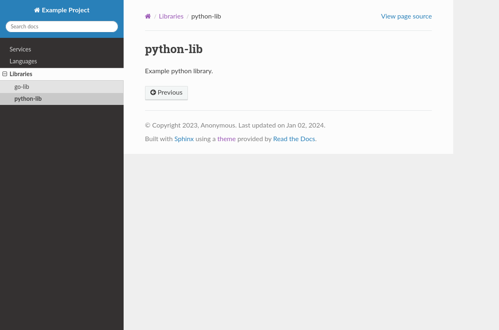
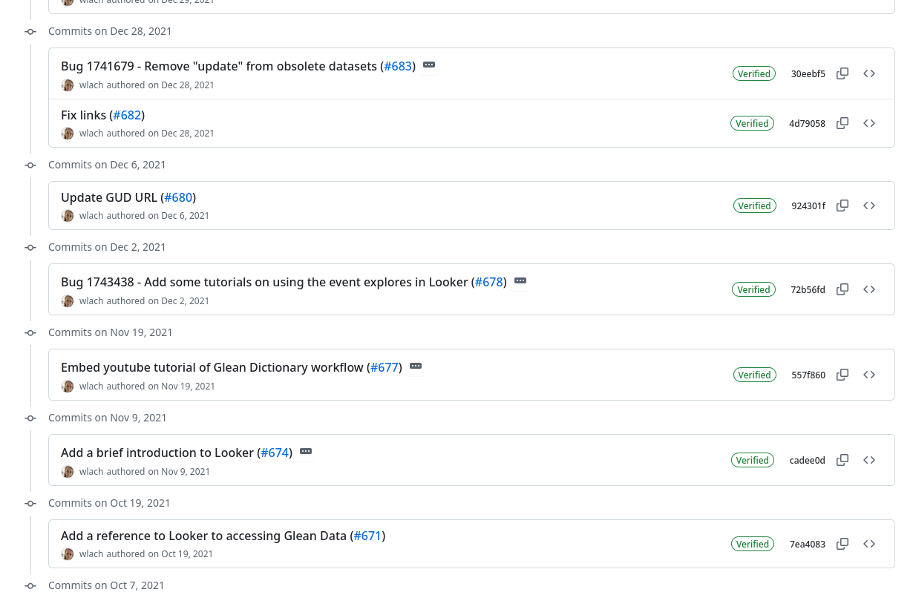

# Writing the Docs: 2026 Edition

It's been about 5 years since I was working heavily on documentation and metadata at Mozilla. I wrote a bunch about this at the time:

- [A principled reorganization of docs.telemetry.mozilla.org](https://archive.wrla.ch/blog/2020/05/%20a-principled-reorganization-of-docs-telemetry-mozilla-org/) (May 2020\)  
- [Mozilla Telemetry in 2020: From “Just Firefox” to a “Galaxy of Data”](https://archive.wrla.ch/blog/2020/07/mozilla-telemetry-in-2020-from-just-firefox-to-a-galaxy-of-data/) (July 2020\)  
- [The Glean Dictionary](https://archive.wrla.ch/blog/2021/01/the-glean-dictionary/) (January 2021).

I don't think I ever wrote about it explicitly, but in the background I (along with a few others at Mozilla Data) were digging deep into "proposal culture" and how to collaboratively build software together using design documentation.

Thinking hard about knowledge systems is a somewhat idiosyncratic obsession, and something I emphasize a little less day-to-day now. That said, I *still* think that putting effort into organizing information and making it legible both leads to better workplaces and makes us generally more productive. Fundamentally, it’s an act of care both to yourself and your peers, past and present. 

Moreover, the core points I was trying to make at the time (either in what I wrote or what I did) mostly still hold:

- Separate the "what" from the "how"  
- Reference documentation should derive from ground truth  
- Document your decisions and process  
- Continuous improvement

As a sort of retrospective, I'd like to revisit these principles 5 years on, with special attention to how they relate to large language models (LLMs). 

I’m going to talk about Mozilla a lot because it’s all on the public record and I can talk about it relatively freely. I haven’t really been involved in the community or watching closely what’s been happening there since [I left in January 2022](https://archive.wrla.ch/blog/2021/12/leaving-mozilla/). Likely the internal perspective at Mozilla these days is different from my own (hopefully not that different 😂).

## Separate the what from the how

This is what I talked about in [A principled reorganization of docs.telemetry.mozilla.org](https://archive.wrla.ch/blog/2020/05/a-principled-reorganization-of-docs-telemetry-mozilla-org/). While I wasn’t aware of it at the time, I was basically repeating the principles of the [diataxis framework](https://diataxis.fr/). Since then, diataxis has become my go-to for describing good documentation, because it's so well written and explained.[^1]

diataxis breaks documentation down into four categories:

- Tutorials: How to do a basic task, step by step: intended for beginners  
- Explanation: Longer documents describing the "why": intended for all  
- How-to: How to accomplish a specific task: intended for non-beginners  
- Reference: Ground truth establishing the "what": intended for all



I think this framework holds up really well, and it’s still the first thing I reach for when thinking about (or explaining) how to write something. Although diataxis was never fully applied, docs.telemetry.mozilla.org became a more useful site for data practitioners after I emphasized tutorials and "getting started" docs, and put the reference and deeper dives later on. It was pretty frequent that I'd be able to answer a question on our internal slack channel and be able to quote a step-by-step link from the docs describing exactly what someone needed to do or know.

My one quibble with diataxis is that sometimes for a complex task you need to *mix* the different types of documentation. [Visualizing Percentiles of a Main Ping Exponential Histogram](https://docs.telemetry.mozilla.org/cookbooks/main_ping_exponential_histograms) was written as a very long and sprawling mix of explanation with theory (even the name is a mouthful), but I think that’s one of its strengths? I got repeated feedback that it was extremely helpful by the Firefox engineers. I can't be totally certain it still holds up today, but I'm fairly certain it does. At the very least, no one has felt motivated to take it down.

Do LLMs change anything here? I would argue no. Although some of the things we want to do now are different (and still changing as of this writing), each has proven useful in its own way.

Tutorials and explanations are the easiest case to make: they are meant for general sense making, and the need for that hasn't gone away at all. Indeed I think as we delegate more of the day-to-day work to machines and reduce the amount of hands-on work which generates understanding, our need for these aids has only increased. I occasionally use LLMs to create initial drafts of this type of work and it’s interesting to see what they miss or get wrong: often some vital fact or nuance is not there, and they have a tendency to emphasize incidental details.

One thing that many people find surprising about tutorials is that they were actually never really meant to describe *how* to do something. Instead, the purpose is primarily just to give some hands-on experience and feeling of success, so they can start feeling more confident in going deeper and doing the more advanced tasks where explanation, how-to, and reference become more important. This need to gain a preliminary understanding of the system has not gone away at all with LLMs-- I maintain that hands-on learning and action is still the best way for most people to learn anything, including how to work with computational systems. Once you've gone beyond the basics, any gaps in understanding or context can be filled in by absorbing the content of deeper articles describing the concepts of a system and why it is the way it is.

Howto documentation (sometimes also called cookbooks or runbooks) are an interesting case, as I feel like this is where things have simultaneously changed the most and the least. Back in the day, I felt that most human written documentation should be exactly this type of thing: it was the most broadly useful and tended to age much better than explanation or reference material that would frequently go out of date. Being able to answer a slack question with a link to this type of material was always satisfying.

Of course now, often it's a large language model or similar executing these types of tasks. Early in 2026, the hot topic was creating [Agent Skills](https://agentskills.io) which are, at heart, just little markdown docs named `SKILL.md` which describe how to perform a particular task. I think they are entirely complementary to the approach. You write a detailed howto describing how to perform a task (using Mozilla data as an example, query a table in BigQuery). An LLM can process a well-written markdown file just as easily as a human: just create an appropriate skill file saying as such:

```md
---  
name: query-main-ping-telemetry-table*  
description: Query the main ping telemetry table in Bigquery*  
---

Refer to `docs/howtos/query-telemetry-table-in-bigquery.md`
```

I'm often surprised at how quickly modern large language models can figure out how to do something essentially from first principles, but if you've arrived at a good solution already, why bother doing that? Just give them a cookbook and save the time and the tokens. And if you need to debug what it's doing (or do part of it yourself), the exact set of steps is right there.

Reference documentation deserves its own treatment. More on it in the next section.

## Reference documentation should derive from ground truth

In [Mozilla Telemetry in 2020: From “Just Firefox” to a “Galaxy of Data”](https://archive.wrla.ch/blog/2020/07/mozilla-telemetry-in-2020-from-just-firefox-to-a-galaxy-of-data/) I talked about how Mozilla's data could no longer reasonably be explained with a few hand-written articles:

> Up until now, our defacto answer has been some combination of “Use the probe dictionary / telemetry.mozilla.org” and/or “refer to docs.telemetry.mozilla.org”. I submit that we’re at the point where these approaches break down: as mentioned above, there are many more types of data we now need to care about than just “probes” (or “metrics”, in Glean-parlance). When we just cared about the main ping, we could write dataset documentation for its recommended access point (main\_summary) and the raw number of derived datasets was manageable. But in this new world, where we have N applications times M ping types, the number of canonical ping tables are now so many that documenting them all on docs.telemetry.mozilla.org no longer makes sense.

I was already thinking about the [Glean Dictionary](https://dictionary.telemetry.mozilla.org) and trying to justify working on it to my peers and upper management. In retrospect, this claim is self-evident: if you're dealing with hundreds or thousands of entities (or more), a manual approach to writing the documentation just isn't going to work. Even if you can generate a perfect first draft, you've only postponed the problem: the implementation *will* change, and independently maintained reference documentation will drift from it.

The solution is to make your reference documentation *derive* from the actual truth of the thing that you're trying to document. This means some kind of machine readable representation: the source code, metrics definitions, dataset definitions, or similar. Critically, the reference documentation should directly link back to that original source, so you can verify (and examine) where these ground truth assertions are coming from. This is why the Glean Dictionary included a link back to the original schema or artifact which generated the documentation:



[https://dictionary.telemetry.mozilla.org/apps/firefox\_desktop/metrics/a11y\_always\_underline\_links](https://dictionary.telemetry.mozilla.org/apps/firefox_desktop/metrics/a11y_always_underline_links)

This is a pretty old idea, dating back to Sphinx’s [autodoc](https://www.sphinx-doc.org/en/master/usage/extensions/autodoc.html) and [doxygen](https://www.doxygen.nl/), although it hasn’t been super consistently applied in modern data engineering from 2020 to 2022 or so. These days, we tend to emphasize getting to an answer (“How many users did XYZ?”) over how the answer was *derived*. Mozilla was a bit of an exception in that it had (hopefully still has) a lot of curious engineers who really *did* care about these details.

When using an LLM, I feel like this type of ground truth is more critical than ever. Much has been written about the tendency of large language models to hallucinate. Conclusions drawn from inaccurate source data can compound, leading to yet more confusion and problems that only get caught at review time (if you're lucky). Having a clear statement of the system-as-it-currently-is (with citations) is the best defense against that. Not only does it reduce the chance of hallucination or confabulation, but it gives a human operator the chance to check the reference and see if it makes sense.

What was maybe a little more controversial (and possibly still is), was my conviction that writing a custom website was the right answer. The world is awash in SaaS companies offering to make sense of a data schema, service architecture, what have you-- why not just use those? At the time I wrote that article, we were considering Google's data catalog and I had to justify why creating a new thing wasn’t [Not Invented Here](https://wiki.c2.com/?NotInventedHere):

> A few months ago, I thought that Google’s Data Catalog (billed as offering “a unified view of all your datasets”) might provide a solution, but on further examination it only solves part of the problem: it provides only a view on your BigQuery tables and it isn’t designed to provide detailed information on the domain objects we care about (products, pings, measures, and tools). You can map some of the properties from these objects onto the tables (e.g. adding a probe’s description field to the column representing it in the BigQuery table), but Data Catalog's interface to surfacing and filtering through this information is rather slow and clumsy and requires detailed knowledge of how these higher level concepts relate to BigQuery primitives.

I haven't looked at Google's Data Catalog (or whatever it’s called now) since then, but I suspect that although it’s probably a great schema viewer, it's still going to be just as confusing for someone who doesn’t work as a data engineer day to day.

It's just inherent: unless your product is a database, the domain of a generic data catalog (schemas, tables) is going to be inherently different than that of your business. This is true whether what you care about is the experience of Firefox users or dispatching taxi cabs. Forcing a data user to think in terms of the former is to move them away from asking actual product questions.

The same really goes for any other "data catalog" SaaS product: in order to work across industries, it needs to express a bunch of concepts which are going to be foreign to your domain. If you're going to go to the trouble of mapping your own concepts and systems to the model of a product like this (which is honestly 90% of the effort, in my experience), putting in a little bit of extra effort to produce a custom interface or website might actually be the missing piece to make that work maximally impactful. This is even easier today thanks to large language models and generally evolving technology and practices.

One area where I *do* think there is still room for development and growth is infrastructure to *create* these custom tools and data representations. Partly based on my experiences with the Glean Dictionary (and associated tools like [probe-scraper](https://github.com/mozilla/probe-scraper) and [mozilla-schema-generator](https://github.com/mozilla/mozilla-schema-generator)), I've been working on a new framework called [repo-parser](https://github.com/wlach/repo-parser) which formalizes this concept of extracting this “ground truth”.

Given a git repository and a set of rules (e.g. “convert this set of markdown frontmatter into a set of tags”), it can take a forest of markdown, yaml, and json and produce either a [duckdb](https://duckdb.org) database or an in-memory representation of the repository’s content. You can use this to populate a data catalog (like the Glean Dictionary), create a dedicated documentation site or any number of other things. 

repo-parser’s [example site](https://repo-parser-demo.netlify.app/) is a mundane example of this. The content in the screenshot is produced from a [README.md](http://README.md) inside the repository, collected and organized dynamically at build-time:



I'm not certain if repo-parser is exactly the right abstraction for building something like this, or if it's more
like an architectural design pattern where every implementation is bespoke. Time will tell.

## Proposals, architectural decision records

Ground truth can tell us *what*, but doesn’t say much about *why*. When I introduced the afore-mentioned dictionary product in [The Glean Dictionary](https://archive.wrla.ch/blog/2021/01/the-glean-dictionary/), embedded within was a link to a [Google docs proposal](https://docs.google.com/document/d/1OkTWA3rsSJ0m5g9GDnxXVUMkJP-xJMQk_bDgDq-Z9xM/edit#).

This was part of a larger movement towards "design docs" that myself and a few of my coworkers were pushing at the time. The idea was, before embarking on a large piece of work, you would write and circulate a large Google Doc containing a problem statement, goals, non-goals, and a preliminary expression of what you were trying to solve and alternatives considered. Then, discussion could proceed asynchronously over docs comments.

I didn't really write a lot about them because (I think) my coworkers wrote and presented on them extremely effectively and I was more interested in, well, the above. But I think they're just as valuable a kind of writing, they answer so many important product and engineering questions:

- Why this design?  
- Why now? (or why then, if looking at the proposal retroactively)  
- How does this impact security, reliability, ... ?  
- What comes next?

I still think proposals are extremely valuable. The obvious benefit is they allow us to reject or modify sub-optimal designs before too much effort is spent building and/or supporting them. But just as importantly, they allow us to distribute understanding of what is being built and why across teams.[^2] In software engineering, it’s one of the best ways I’ve found to align a diverse group of human beings around a single objective.

This wisdom was pretty old even then: the influential article on [Design Docs at Google](https://www.industrialempathy.com/posts/design-docs-at-google/) dates all the way back to 2015, best I can tell. There are other precursors \-- for example, [Painless Functional Specifications](https://www.joelonsoftware.com/2000/10/02/painless-functional-specifications-part-1-why-bother/) by Joel Spolsky way back from the year 2000. I'm sure you can find articles about this all the back to the 70s, or even earlier if you look hard enough. However, I've noticed that many organizations struggle to have a good proposal culture. If the ideas are so obvious, why?

Some issues go well beyond the scope of this article: I do think that having an effective proposal requires a strong commitment to [psychological safety](https://archive.wrla.ch/blog/2021/10/learning-about-psychological-safety-at-the-recurse-center/). If people don't feel like their design or feedback is going to be taken in good faith, the proposal process won't work very well. People will be hesitant to put things out there and to engage, and the opportunity for learning will be reduced. In a healthy workplace, people are constantly being guided towards presenting their best ideas, with the knowledge that their colleagues are there to support them.

Looking at how large language models have affected things, I have two answers: "almost not at all" and “totally".

For the traditional "big google doc" type proposals I talk about above, I lean towards thinking that these should continue to be used (more or less) the way they were before: as a means for human beings to align on the right solution to a problem. A large language model can help with the initial brainstorming producing the first draft, but to be maximally effective both the initial communication and response should be the product of human interaction. That ensures that the proposal is an expression of a fully fleshed out train of thought and represents real effort. Likewise, the responses to it represent a real attempt to engage with and learn from the content.

On the other hand, I think for our day-to-day where the implementation is largely produced by a large language model, I have found the above formula useful in an unexpected way: as a way to converse and convey requirements to a machine. 

These days, I spend more of my time prompting an LLM than writing code myself. But since they have the memory of a goldfish, I’ve found getting them to produce the right thing a bit of a crapshoot. Yes, there is [AGENTS.md](http://AGENTS.md) but that can only tell it so much: there’s always more “implicit” context that is needed to solve a problem of any complexity. And even with extremely long context, important facts can be missed or given too little weight.

Since I found that I was encoding these details in a prompt, I thought: *hey, why not just make the prompt a design doc*? Have a human express the intent, goals, non-goals and a sketch of a solution in a markdown document and then *collaborate* with an LLM on the detailed design. Then, once you’re happy with the result, proceed with implementation. The result can then be checked in along with the code as a sort of guide to understanding what was done. In a pull request type work flow, it can be critiqued or commented on like any other code artifact.

If you’re familiar with plan mode, a lot of this might sound familiar. The key difference is a fairly deliberate structure (explicit dating and proposal template) and a higher level of human involvement in the earlier stages of design. To incorporate some notion of chronology (since IDRs are meant to be “moments in time”), I used a filename convention inspired by database migration tools like [alembic](https://alembic.sqlalchemy.org/en/latest/) and [goose](https://github.com/pressly/goose) (for example: `202601180308-upload-packages-to-pypi.md`) and a design template that should be familiar if you’ve read [Design Docs at Google](https://www.industrialempathy.com/posts/design-docs-at-google/):

```md
# 2026-01-18: Upload packages to PyPI

Owner: Will Lachance <wlach@protonmail.com>

## Overview

### Problem Statement

Save maintainer time and avoid security gotchas by using github actions to upload to pypi

### Context (as needed)

This repo ships a Rust CLI as a Python package via \`maturin\` (\`bindings \= "bin"\`). CI already builds wheels on Linux/macOS/Windows and runs a smoke test from the built wheel.

### Goals

- Make it easier to publish new releases  
- Improve security

### Non-Goals

- Automate version bumping (will still entail a seperate commit to bump version)

### Proposed Solution 

…
```

I've found this a nice additional specialization of proposals, and have found it really helpful in my own work. If you're curious about this, check out the [idr-tools](https://github.com/wlach/idr-tools) repository, where I've been exploring this idea further. You can see a few samples of the idea both there and in repo-parser (in the [idrs](https://github.com/wlach/repo-parser/tree/main/idrs) subdirectory).

## Always be improving

One through-line which is in the above work which I didn't blog about explicitly: always be improving. Typos, fixing bitrotted instructions, little improvements in clarity: over time this type of enhancement ensures that the documentation is maximally useful both to humans and machines.



[https://github.com/mozilla/data-docs/commits?author=wlach](https://github.com/mozilla/data-docs/commits?author=wlach)

You can use an LLM to do this automatically, but obviously you want a human being to review the output. Either way, the end result is the same: better end-user documentation and an (infectious) demonstration of actual care. It’s a way of supporting others, including your future self. After some time, repeated small actions become a habit, others follow along and it fades into the background as “the way we do things around here”.

## Conclusion

Although I wouldn't write the above articles in the same way (or possibly even write them at all) today, I do think the conclusions hold up-- in some cases even more strongly-- in the new, strange world of large language models. So long as there are complex systems, I don't think describing them in forms *that are meant to explain* will go out of style. If anything, it becomes more powerful and needed at all stages of the design and build process.   

[^1]:  Sometimes people talk about the divio documentation system, but as I understand it, it’s just a precursor to diataxis (created by the same author).

[^2]:  I believe the same is true of code review, but that’s another story.
