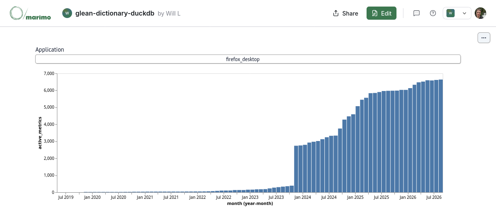

# Glean Dictionary + DuckDB

While working on [Writing the Docs: 2026 Edition](https://wrla.ch/log/2026/08/writing-the-docs-2026-edition/),
I experimented a bit with updating the [Glean Dictionary](https://github.com/mozilla/glean-dictionary) to 
incorporate some of the ideas in the essay, in particular those around reference documentation.

As a sort of demonstration that documentation *about* an application can be
treated as a data product in and of itself, I hacked up a [quick ETL pipeline](https://github.com/wlach/glean-dictionary/commit/13dbdb005b5ee8399e7169962711be418066def2#diff-d9d516c7dbf3d149aa587b0a96e73e2ab209d5d7753915f5e4ce304df5f757d8) to dump the JSON output of the Glean Dictionary into a [DuckDB](https://duckdb.org/) database that can be queried standalone.

Since the Glean Dictionary is just a static [Netlify](https://www.netlify.com/) site, the DuckDB database can simply
be published alongside as a standard file. 
This allows you to do fun things from the DuckDB console like:

```
memory D ATTACH 'https://glean-dictionary-DuckDB.netlify.app/data/glean_dictionary.DuckDB' AS glean_dictionary (READ_ONLY);
memory D SELECT type, count(*) AS metrics
         FROM glean_dictionary.metrics
         GROUP BY type
         ORDER BY metrics DESC;
┌─────────────────────────────┬─────────┐
│            type             │ metrics │
│           varchar           │  int64  │
├─────────────────────────────┼─────────┤
│ counter                     │   20057 │
│ event                       │    7256 │
│ string                      │    3545 │
│ labeled_counter             │    3275 │
│ timing_distribution         │    2481 │
│ custom_distribution         │    2169 │
│ quantity                    │    1406 │
│ boolean                     │    1078 │
│ text                        │     588 │
│ labeled_timing_distribution │     569 │
│ datetime                    │     404 │
│ memory_distribution         │     389 │
│ object                      │     369 │
│ labeled_custom_distribution │     340 │
│ rate                        │     215 │
│ dual_labeled_counter        │     210 │
│ string_list                 │     204 │
│ uuid                        │     181 │
│ timespan                    │     149 │
│ labeled_boolean             │     118 │
│ labeled_string              │      84 │
│ labeled_memory_distribution │      66 │
│ labeled_quantity            │      42 │
│ url                         │      26 │
└─────────────────────────────┴─────────┘
  24 rows                     2 columns
```

From there, you could either build an interface like the Glean Dictionary itself (much easier to do from
a database than the somewhat harebrained dataclass soup I originally came up with) or any number
of other data products or analyses. Here's an example marimo notebook that tracks the metrics added
to each product over time:



[Open in Molab](https://molab.marimo.io/notebooks/nb_5vHgD1X1DY4RQV8rwgi7iu/app)

As you can see, the number of metrics did a big jump in 2024 (I imagine they finally moved Firefox Desktop over to Glean) with slower and steadier growth since.
